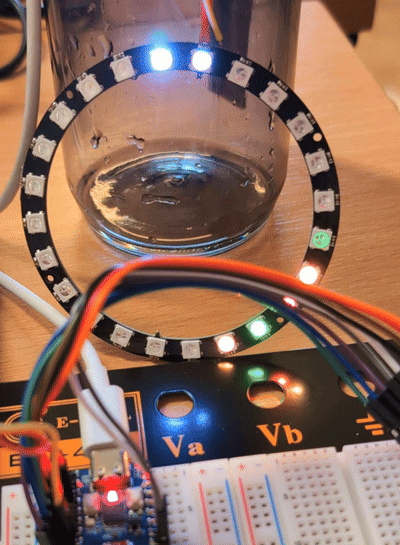
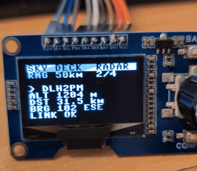

# Sky Radar

A ring of 24 LEDs that shows every aircraft around you right now, each one
a dot in the direction the plane actually is. Flip a switch and the ring
points at the International Space Station instead.

It runs in MicroPython on a tiny ESP32-C3 board, pulls live ADS-B data over
WiFi and needs no API keys. Built in an afternoon at Byte Me's hackathon
[Build 4 Cyberdeck](https://luma.com/6ylas0ll) in Uppsala (2026-10-03), where
the challenge was to build something that fits in 4 MB of flash. On the day
it grew a screen and a knob and was demoed as **Sky Deck**.

<p align="center">
  
  
</p>
<p align="center"><sub>Live at the hackathon: the ring with real traffic and its radar sweep, and the knob stepping through the aircraft in range.</sub></p>

## What it does

**Radar mode**

- The ring is a compass. Every aircraft within range lights the LED that
  points towards it, brighter when it is closer.
- Colour is altitude: red is low (taking off or landing), yellow and green
  in between, blue is cruising altitude. A dim white dot always marks north.
- A green sweep goes round every 3 seconds, like a real radar screen. It
  turns red and the dots fade if no fresh data has arrived for 20 seconds.
- Zoom between 25, 50 and 75 km, so there is always something to see:
  25 km when the airport is busy, 75 km on a quiet evening.
- Everything is in km and metres. The APIs speak nautical miles and feet,
  which mean nothing to most people watching.

**ISS mode**

- One LED points at the space station. It circles the Earth in about 90
  minutes, so over an afternoon the dot wanders round the ring.
- White when the ISS is in sunlight, blue when it is in the Earth's shadow.
- When it is above your horizon (within about 2,250 km) the whole ring
  pulses.

**Optional extras**

- **Screen and knob:** a 128x64 OLED module with a rotary encoder. Turn the
  knob to step through the aircraft (the selected one blinks white on the
  ring) and the screen shows its callsign, altitude, distance and bearing.
- **8x8 matrix:** a second unit that draws the radar seen from above, so
  you get distance as well as direction.

A frame from the terminal prototype, which runs the same code without any
hardware (the interface text is in Swedish, "plan" means aircraft):

```
                     N                        RADAR  75 km  15 plan
                                              källa: opendata.adsb.fi  uppdaterad 1 s sedan
                 ·   ●   ·
            ●                 ·               SAS51D    2 260 m  250°   10,3 km
         ●                       ·            RYR8QX      670 m  122°   23,4 km
                                              SWR2YB      560 m  153°   31,6 km
      ●                             ·         FIN1BA   12 630 m  199°   31,7 km
                                              NJE473G   3 110 m  177°   36,8 km
     ·                               ·        SAS1131   2 590 m  187°   51,5 km
                   RADAR                      SAS495    6 870 m  245°   54,4 km
V   ·              75 km              ·   Ö   NSZ2633   2 740 m  155°   55,5 km
                                              FUU231A     680 m  165°   55,9 km
     ●                               ·        DFL5980     270 m  142°   59,8 km
                                              ... och 5 till
      ●                             ●
                                              8x8-matris:
         ●                       ●            · · · · · · · ·
            ●                 ●               · · · · · · · ·
                 ●   ●   ●     ARN            · · · · · · · ·
                                              · · · · · · · ·
                     S                        · · · ● ● · · ·
                                              ● ● · ● ● · · ·
                                              · ● ● ● ● ● · ·
                                              · · ● · · · · ·
```

## How it works

```
adsb.fi / adsb.lol  --HTTPS-->  ESP32-C3       -->  LED ring
wheretheiss.at      --HTTPS-->  (MicroPython)  -->  OLED, 8x8 matrix
                                     ^
                          knob and buttons: select, zoom, mode
```

- **No trigonometry for the radar.** The ADS-B API returns each aircraft's
  bearing (`dir`) and distance (`dst`) from the point you ask about. Bearing
  divided by 360 times the number of LEDs gives the LED to light.
- **ISS bearing** is computed on the board from the station's latitude and
  longitude with the great-circle formula. `math` is enough.
- **Fetching runs in its own thread.** A TLS handshake takes about 2 seconds
  on the ESP32-C3, and the sweep would freeze for that long otherwise.
- **Fallbacks everywhere.** Each data source has a backup, the source that
  answered last is tried first, and the last known aircraft stay on the
  ring (fading) while the network is down.
- **One core, two runtimes.** All logic lives in `pico/core.py`, plain
  Python with no hardware or network code. It runs unchanged on the board
  and on a laptop, which is what the tests and the terminal prototype use.

## Hardware

| Part | Needed | Notes |
|---|---|---|
| ESP32-C3 board | yes | Tested on Waveshare ESP32-C3-Zero (ring unit) and ESP32-C3 SuperMini (matrix unit). 4 MB flash, WiFi on 2.4 GHz only |
| WS2812 (NeoPixel) ring, 24 LEDs | yes | Other sizes work, set `N_LEDS` |
| USB-C cable that carries data | yes | Some "charging" cables do, some do not |
| 1.3" OLED module with rotary encoder | optional | 128x64, SH1106 or SSD1306, with BACK and CONFIRM buttons (pins labelled CON SDA SCL PSH TRA TRB BAK GND VCC) |
| WS2812 8x8 matrix plus a second ESP32-C3 | optional | Runs the same code with the `matris` profile |
| Breadboard and jumper wires | optional | The ESP32-C3-Zero has a single GND pin, so sharing ground needs a breadboard |
| Diffuser | optional | Baking paper or a frosted lid makes the LEDs glow instead of glare |

A Raspberry Pi Pico 2 W should work too (the core is plain MicroPython), but
the board code has only been run on ESP32-C3 so far.

**Power:** 24 LEDs at full white draw about 1.4 A and USB gives about 0.5 A.
Brightness is capped with `MAX_BRIGHTNESS` (0.2 by default), which is
plenty indoors.

### Wiring the ring unit (ESP32-C3-Zero)

| From | To |
|---|---|
| Ring DI (data in, not DO) | GPIO3 |
| Ring 5V | 5V |
| Ring GND | GND |
| OLED VCC | 3V3 (not 5V, or the I2C pull-ups lift the pins to 5 V) |
| OLED GND | GND |
| OLED SDA / SCL | GPIO4 / GPIO5 |
| Encoder push (PSH) | GPIO6 |
| Encoder TRA / TRB | GPIO7 / GPIO0 |
| BACK (BAK) | GPIO1 |
| CONFIRM (CON) | GPIO2 |

The pin names on the ESP32-C3-Zero are printed on the underside only. The
matrix unit is an ESP32-C3 SuperMini with the matrix DIN on GPIO4 and
nothing else to wire.

## Getting started

You need Python 3, [`esptool`](https://github.com/espressif/esptool) and
[`mpremote`](https://docs.micropython.org/en/latest/reference/mpremote.html):

```bash
pipx install esptool
pipx install mpremote
```

**1. Flash MicroPython** onto the board. Download the `ESP32_GENERIC_C3`
firmware from [micropython.org](https://micropython.org/download/ESP32_GENERIC_C3/)
(tested with 1.29.0):

```bash
FIRMWARE=~/Downloads/ESP32_GENERIC_C3-20260824-v1.29.0.bin
esptool --chip esp32c3 erase-flash
esptool --chip esp32c3 write-flash 0 "$FIRMWARE"
```

**2. Set your location.** The default is the hackathon venue in Uppsala.
Create `pico/config_local.py` (git ignores it) with your own coordinates:

```python
PLACE = "Stockholm Central Station"
LAT = 59.3298746
LON = 18.0575007
```

To look up an address: `./terminal/plats.py "Stockholm Central Station"`
(uses OpenStreetMap). Or right-click the spot in Google Maps and copy the
coordinates from the top of the menu.

**3. Copy the code to the board and run it:**

```bash
./scripts/till-kortet.sh          # ring unit ("till kortet" = to the board)
./scripts/till-kortet.sh matris   # matrix unit
```

The first run asks for a WiFi name and password and stores them in
`pico/secrets.py` (git ignores it, the password is never echoed). Add more
networks with `./scripts/wifi.sh`; the board joins the first one it can see.
`main.py` stays on the board and starts by itself on power-up, no laptop
needed.

**4. Point north.** At startup a dot runs one lap from the LED the code
thinks is north. Turn the ring until the dim white north dot faces north
(a phone compass is enough).

The boards only do 2.4 GHz. If you use a phone hotspot, force it to 2.4 GHz
with WPA2 security.

## Controls

| Control | Does |
|---|---|
| BOOT button, short press | Zoom: 25, 50, 75 km (starts at 75) |
| BOOT button, long press | Switch between radar and ISS |
| Turn the knob | Select an aircraft, nearest first |
| Push the knob | Zoom |
| BACK | Switch between radar and ISS |
| CONFIRM | Not used yet |

The board's own RGB LED shows status: green for fresh data, red for stale
data, blue for no WiFi.

[`docs/manual.md`](docs/manual.md) explains how to read the ring and the
screen and what to do when something goes wrong.

## Configuration

Defaults live in `pico/config.py`. Override anything in
`pico/config_local.py`, which git ignores and the copy script sends along.
The most useful settings:

| Setting | Default | What it is |
|---|---|---|
| `LAT`, `LON`, `PLACE` | Uppsala | Where the radar stands |
| `N_LEDS` | 24 | LEDs on the ring |
| `LED_NORTH` | 0 | The LED that should point north |
| `CLOCKWISE` | `True` | Do the LED numbers run clockwise seen from above? |
| `MAX_BRIGHTNESS` | 0.2 | Keeps the current within what USB can give |
| `ZOOM_KM` | (25, 50, 75) | Zoom steps. 150 km runs out of memory with the screen on |
| `GRID_SERPENTINE` | `False` | Set if the matrix rows zigzag |
| `WIFI_TXPOWER` | `None` | Set to 8.5 if WiFi will not connect (common on cheap C3 boards) |

Pins per board live in `pico/boards/`, one file per profile. The copy
script puts the chosen profile on the board as `board.py`. Add your own
profile for a different board or wiring.

## Without hardware

The terminal prototype runs the same core and settings and needs nothing
but the Python standard library:

```bash
./terminal/radar.py                                      # live: z = zoom, m = mode, q = quit
./terminal/radar.py --plats "Uppsala Cathedral"          # look up a place first
./terminal/radar.py --record recordings/today.jsonl      # record while watching
./terminal/radar.py --replay recordings/today.jsonl      # replay offline
./terminal/radar.py --once --mode iss                    # one frame, then exit
```

Check that all data sources answer and list the aircraft in range:

```bash
LAT=59.3298746 LON=18.0575007 RADIE_KM=25 ./scripts/kolla-api.sh
```

## Tests

```bash
python3 tests/test_core.py
micropython tests/test_core.py   # the unix port of MicroPython
```

The core also parses a real 15 KB API response (23 aircraft) within a
128 KB MicroPython heap.

## Repository layout

```
pico/core.py            all logic, runs unchanged on laptop and board
pico/config.py          location, pins, LEDs, zoom, data sources
pico/main.py            the board code: WiFi, fetching, LEDs, screen, knob
pico/oled.py            driver for 128x64 SSD1306 and SH1106 screens
pico/boards/            one profile per board: ring.py, matris.py (matrix)
terminal/radar.py       terminal prototype and backup demo
terminal/plats.py       address to coordinates via OpenStreetMap
tests/test_core.py      tests, run with python3 and micropython
scripts/till-kortet.sh  copy the code to a board and run it
scripts/wifi.sh         add a WiFi network
scripts/kolla-api.sh    check that the data sources answer
docs/manual.md          using it: reading the ring, controls, troubleshooting
docs/notes.md           measurements, data pitfalls, ESP32-C3 lessons
```

Code comments and some script names are in Swedish.

## Data sources

All free, no API key, all checked to work with the board's TLS.

| Service | Used for | Terms |
|---|---|---|
| [adsb.fi open data](https://github.com/adsbfi/opendata) | Aircraft, first choice | Personal and non-commercial use, max 1 request per second, credit adsb.fi with a link |
| [adsb.lol](https://api.adsb.lol) | Aircraft, backup | Same response format |
| [wheretheiss.at](https://wheretheiss.at/w/developer) | ISS, first choice | Max 350 requests per 5 minutes |
| [Open Notify](http://open-notify.org) | ISS, backup | Plain HTTP |

The radar fetches every 4 seconds and the ISS every 10, well within the
limits. The MIT license below covers this code, not the data: if you show
the radar in public, put a note next to it saying "Flight data: adsb.fi".

## Ideas

- Count of people in space right now, one LED each
  (`http://api.open-notify.org/astros.json`).
- Aurora mode from NOAA's Kp index: a green glow when there is a chance of
  northern lights overhead.
- Sync the selected aircraft from the knob to the matrix unit over ESP-NOW.
- A voice on CONFIRM that reads out the selected flight.
- 150 km zoom, which needs leaner parsing to fit in memory.

## License

[MIT](LICENSE). Flight data from [adsb.fi](https://adsb.fi).
